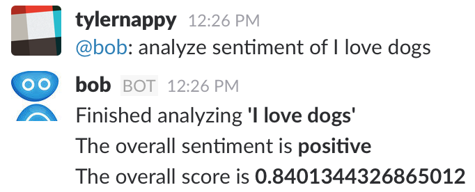

# Slackbot using Haven OnDemand Sentiment Analysis and Botkit
A simple example to show how to incorporate Haven OnDemand into a Slackbot.

## What this does
Prompt the Slackbot in the slack channel with a sentence and it will analyze the sentiment of it.



## To download
In your terminal:
```
git clone https://github.com/HPE-Haven-OnDemand/slackbot-sentiment-analyzer
```
```
cd slackbot-sentiment-analyzer
```
```
npm install
```
Then, add your Slackbot token and Haven OnDemand API key to the `index.js` file.

## Technology used
* [Haven OnDemand](http://havenondemand.com/)
* [Slackbots](https://github.com/howdyai/botkit/blob/master/readme-slack.md)
* [Node.js](https://nodejs.org/en/)
* [Botkit](https://howdy.ai/botkit/)
